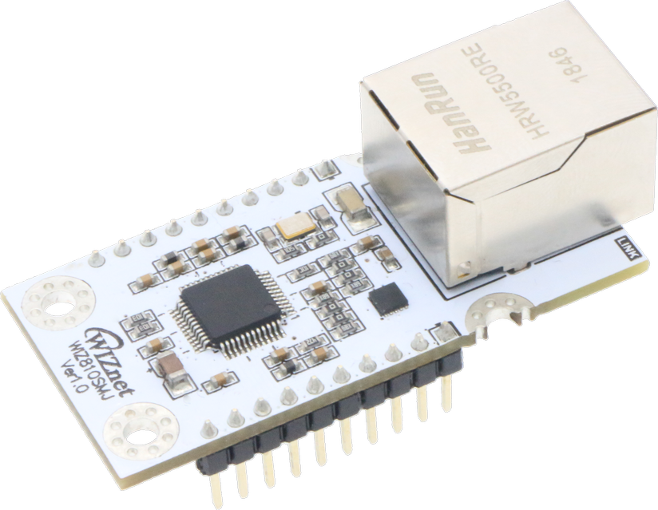

# WIZ810SMJ 

## History
**2019/07/09**

- WIZ810SMJ V1.0 Initial Release

## Overview

WIZ810SMJ is the network module that includes W5100S (TCP/IP hardwired chip, include PHY), MAG-JACK (RJ45 with X’FMR) with other glue logics. It can be used as a component and no effort is required to interface W5100S and Transformer. The WIZ810SMJ is an ideal option for users who want to develop their Internet enabling systems rapidly.

 [***WIZ810SMJ Official Wiki page***](https://wizwiki.net/wiki/doku.php?id=products:wiz810smj:start)

## Features

- Support Hardwired Internet protocols
  - : TCP, UDP, WOL over UDP, ICMP, IGMPv1/v2, IPv4, ARP, PPPoE
- Support 4 independent SOCKETs simultaneously
- Supports half/full duplex operation
- Support SOCKET-less command
  - : ARP-Request, PING-Request
- Support Ethernet Power down mode & Main Clock gating for power save
- Support Wake on LAN over UDP
- Supports high speed SPI Interface (SPI mode 0/3), Parallel System Bus with 2 Address signal & 8bit Data
- Internal 16Kbytes Memory for TX/ RX Buffers
- 10BaseT/100BaseTX Ethernet PHY Integrated
- Support Auto Negotiation (Full and half duplex, 10 and 100-based )
- Supports Wake On LAN
- Support Auto-MDIX only when Auto-Negotiation mode
- 3.3V operation with 5V I/O signal tolerance
- Interfaces with two 2.54mm pitch 1 x 10 header pin
- Temperature : -40 ~ 85℃(Operation)

