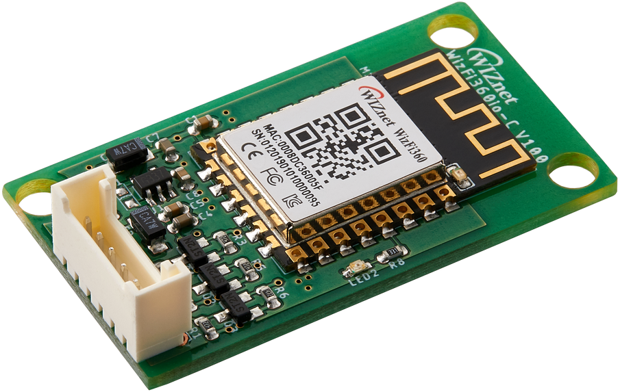

# WizFi360io-C

## History
**2019/07/25**

- WizFi360io-C V1.0 Initial Release

## Overview

 [***WizFi360io-C Official Wiki page***](https://wizwiki.net/wiki/doku.php?id=products:wizfi360:board:wizfi360io-c:start)

  # 1.    Overview

 This document describes WizFi360io-C. The operating voltage of the WizFi360io-C and the UART voltage are 5V. WizFi360io-C can connect the UART interface to the connector. The part name of the connector mounted on WizFi360io-C is "SMW200-06". The cable connector that can be connected to "SMW200-06" is "SMH200-06".

WizFi360 is a low cost and low-power consumption industrial-grade WiFi module. It is compatible with IEEE802.11 b/g/n standard and supports SoftAP, Station and SoftAP+Station modes. The serial port baud rate can be up to 2Mbps, which can meet the requirement of various applications.

  

  # 2.    Features

- WizFi360

  - WiFi 2.4G, 802.11 b/g/n
- Support Station / SoftAP / SoftAP+Station operation modes
  - Support “Data pass-through” and “AT command data transfer” mode
- Support serial AT command configuration
  - Support TCP Server / TCP Client / UDP operating mode
- Support configuration of operating channel 0 ~ 13
  - Support auto 20MHz / 40MHz bandwidth
- Support WPA_PSK / WPA2_PSK encryption
  - Serial port baud rate up from 600bps to 2Mbps with 16 common values
- Support up to 5 TCP / UDP links
  - Obtaining IP address automatically from the DHCP server (Station mode)
- DHCP service for Wireless LAN clients (AP mode)
  - Support DNS for communication with servers by domain name
- Support “Keep-Alive” to monitor TCP connection
  - Support “Ping” for monitoring network status
- Built-in SNTP client for receiving the network time
  - Support built-in unique MAC address and user configurable
- Support firmware upgrade by UART Download / OTA (via WLAN)
  - Industrial grade (operating temperature range: -40 ° C ~ 85 ° C)
- CE, FCC certification 
- ETC
    - 5V Operating Voltage
      - Built-in LDO
      - WizFi360 operates at 3.3V
    - 5V voltage UART
      - Built-in Level Shifters
      - WizFi360 operates at 3.3V
    - SMW200-06 Mounted
      - Cable side connector is SMH200-06

