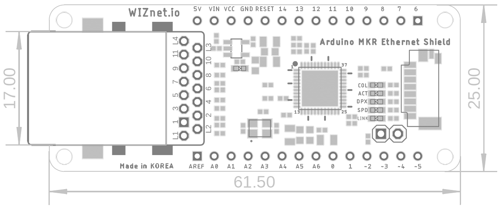

# W5100S MKR-Ethernet Shield

## History
**2018/12/04**

- W5100S MKR-Ethernet Shield Initial Release

## Overview

## Features

- Operation Voltage DC5V or DC3.3V
  - Signals (SPI) Voltage 3.3V 
- Included W5100S of WIZnet
- W5100S is software compatible with the W5100.
  - Compatible with the official Arduino Ethernet shield(W5100) - **Default**
  - Compatible with the official Arduino Ethernet Shield 2(W5500) at user choice - **Optional**
- SPI Interface
- 10/100 Ethernet PHY embedded
- Support Auto Negotiation
  - Full / Half Duplex
  - 10/ 100 Based
- Hardware TCP/IP Protocols
  - TCP, UDP, ICMP, IPv4, ARP, IGMP, PPPoE
- Support Micro SD Card slot for storage

## Pinout

## Dimension

