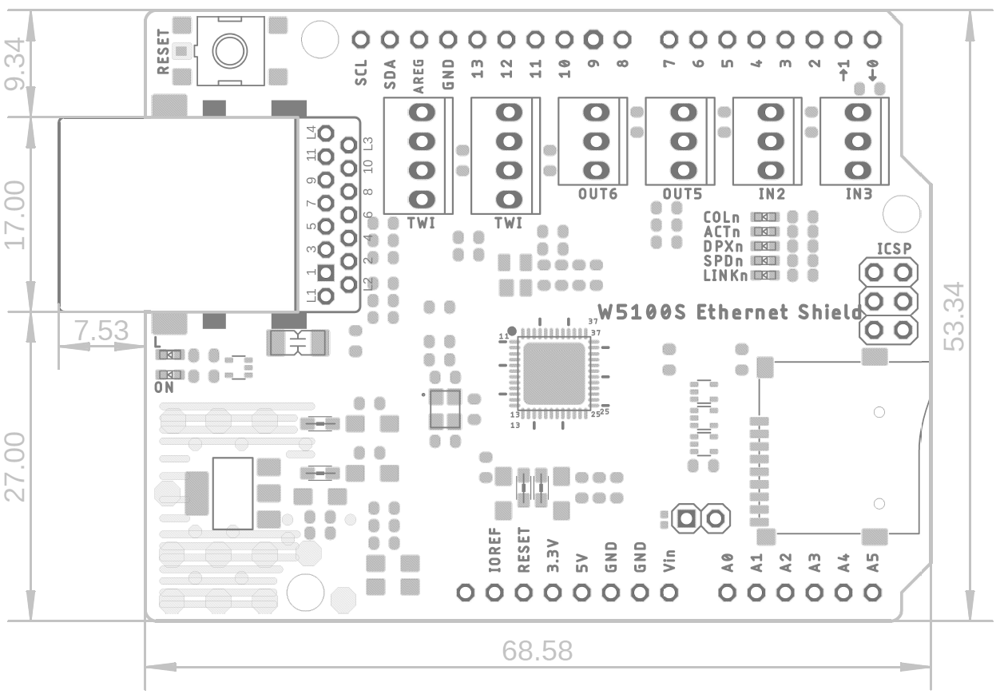

# W6100 Ethernet Shield

## History
**2019/02/15**

- W6100 Ethernet Shield V1.1 Initial Release

## Overview

## Features

-  Operation Voltage DC5V or DC3.3V
  -  Signals (SPI) Voltage 3.3V 

- Included W6100 of WIZnet

- SPI Interface

- 10/100 Ethernet PHY embedded

- Hardware TCP/IP Protocols
  - TCP, UDP, IPv6, IPv4, ICMPv6, ICMPv4, IGMP, MLDv1, ARP, PPPoE

- Support IPv4/IPv6 Dual Stack

- Support 8 independent SOCKETs simultaneously with 32KB Memory

- Support SOCKET-less Command: ARP, PING, ICMPv6(PING, ARP, DAD, NA, RS) Command for IPv6 Auto-configuration& Network Monitoring

- Support Auto Negotiation
  - Full / Half Duplex
  - 10/ 100 Based

- Support Micro SD Card slot for storage

- Low height RJ45

## Call-out

## Pin-out

## Dimension

